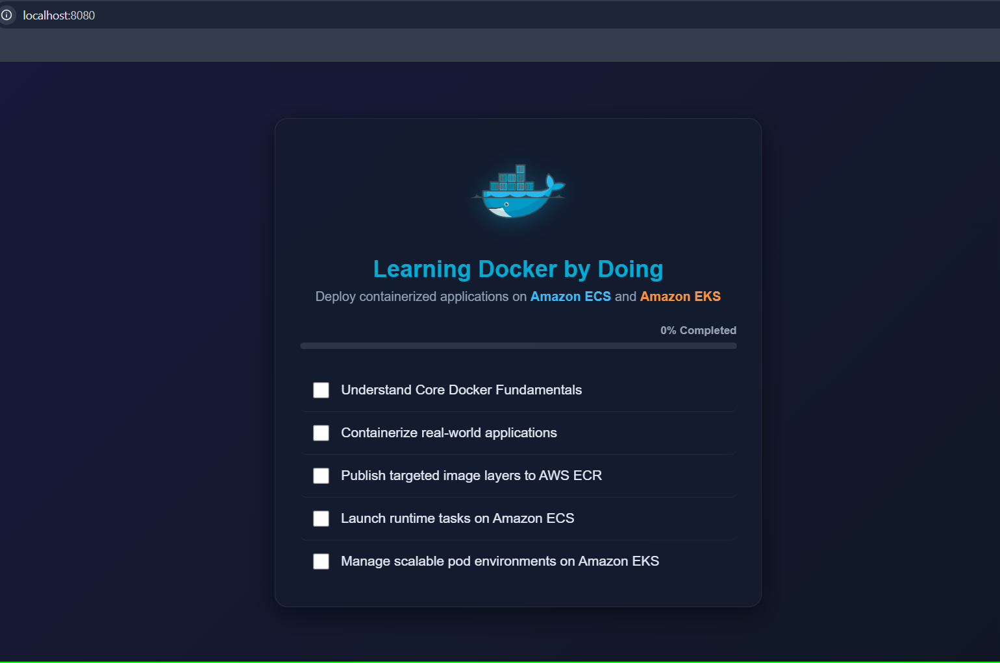
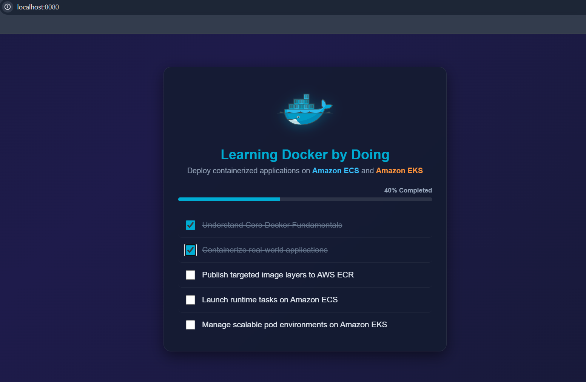

# Capstone 01 – Static Website Deployment with Docker

## 📌 Overview

This project demonstrates the fundamentals of Docker by containerizing a custom static website using Nginx.

The goal of this capstone is to understand the complete Docker workflow that forms the foundation for deploying containerized applications to AWS services such as Amazon ECS and Amazon EKS.

---

## 🎯 Objectives

* Build a custom static website.
* Write a Dockerfile.
* Build Docker images locally.
* Run containers from custom images.
* Expose applications using port mapping.
* Practice container lifecycle operations.
* Rebuild and redeploy updated application versions.

---

## 🏗️ Project Architecture

```text
index.html
    ↓
Dockerfile
    ↓
Docker Image
    ↓
Docker Container
    ↓
Browser
```

---

## 📂 Project Structure

```text
capstone-01-static-website/
├── Dockerfile
├── index.html
└── README.md
```

---

## 🛠️ Technologies Used

* Docker
* Nginx
* HTML
* Git
* GitHub

---

## 🐳 Dockerfile

```dockerfile
# Use the official Nginx image as the base image
FROM nginx:latest

# Replace the default Nginx page with our custom webpage
COPY index.html /usr/share/nginx/html/index.html
```

---

## 🚀 Build the Docker Image

```bash
docker build -t static-website:v1 .
```

---

## ▶️ Run the Container

```bash
docker run -d --name static-site -p 8080:80 static-website:v1
```

---

## 🌐 Access the Website

Open the browser and visit:

```text
http://localhost:8080
```

---

## 📸 Live Website Screenshot

Below is a screenshot of the running website served from the Docker container.

Example display:


---

## 🔄 Updating the Application

After modifying the website:

### Build a new version

```bash
docker build -t static-website:v2 .
```

### Stop and remove the previous container

```bash
docker stop static-site
docker rm static-site
```

### Run the updated version

```bash
docker run -d --name static-site -p 8080:80 static-website:v2
```
---

## 📸 Live Website Screenshot

Below is a screenshot of the running website served from the Docker container.


---

## 📚 Concepts Learned

* Docker Images
* Docker Containers
* Dockerfile Fundamentals
* `FROM`
* `COPY`
* Building Images
* Running Containers
* Port Mapping
* Container Lifecycle Management
* Image Versioning
* Redeployment Workflow

---

## ☁️ AWS Relevance

This capstone establishes the Docker foundation required for:

* Amazon ECR (Elastic Container Registry)
* Amazon ECS (Elastic Container Service)
* Amazon EKS (Elastic Kubernetes Service)

Understanding how to package and run applications locally is the first step toward deploying and managing containerized workloads on AWS.

---

## 🏁 Outcome

By completing this project, I learned how to containerize a static application, build Docker images, manage containers, and perform application updates using Docker's image-based deployment workflow.

This project marks the beginning of my journey toward deploying cloud-native applications on AWS using ECS and EKS.
