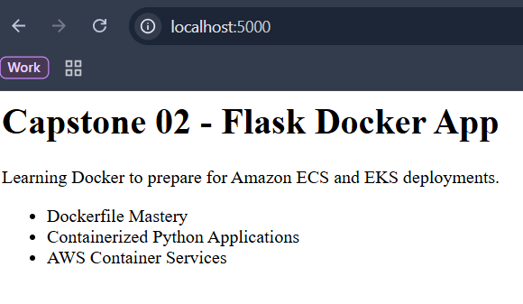
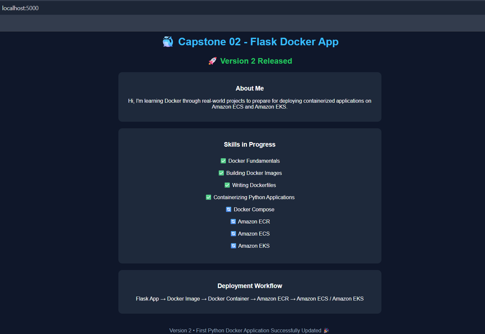

# Capstone 02 – Containerizing a Python Flask Application with Docker

## 📌 Overview

This project demonstrates how to containerize a real Python Flask application using Docker.

The objective of this capstone is to move beyond static websites and learn how to package application code, dependencies, and runtime environments into portable Docker images that can later be deployed to AWS container services such as Amazon ECS and Amazon EKS.

---

## 🎯 Objectives

* Build a Python Flask application.
* Test the application locally.
* Write a production-aware Dockerfile.
* Build Docker images.
* Run Flask applications inside Docker containers.
* Update and redeploy application versions.
* Implement `.dockerignore`.
* Understand Docker layer caching.
* Improve container security using non-root users.

---

## 🏗️ Project Architecture

```text
Flask Application
        ↓
requirements.txt
        ↓
Dockerfile
        ↓
Docker Image
        ↓
Docker Container
        ↓
Browser
```

---

## 📂 Project Structure

```text
capstone-02-flask-dockerfile/
├── app.py
├── requirements.txt
├── Dockerfile
├── .dockerignore
├── README.md
└── screenshots/
```

---

## 🛠️ Technologies Used

* Docker
* Python
* Flask
* Git
* GitHub

---

## 🐍 Flask Application

The application serves a simple web page describing my Docker learning journey toward AWS container platforms.

Features include:

* About Me section
* Skills in Progress
* Deployment Workflow
* Version updates

---

## 🐳 Dockerfile

```dockerfile
# Use official lightweight Python image
FROM python:3.12-slim

# Create a non-root user for security
RUN useradd -m appuser

# Set working directory
WORKDIR /app

# Copy dependency file first for layer caching
COPY requirements.txt .

# Install dependencies
RUN pip install --no-cache-dir -r requirements.txt

# Copy application code
COPY app.py .

# Change ownership of application files
RUN chown -R appuser:appuser /app

# Switch to the non-root user
USER appuser

# Document application port
EXPOSE 5000

# Start Flask application
CMD ["python", "app.py"]
```

---

## 🚀 Build the Docker Image

### Initial Build

```bash
docker build -t flask-app:v1 .
```

### Updated Releases

```bash
docker build -t flask-app:v2 .
docker build -t flask-app:v3 .
docker build -t flask-app:v4 .
docker build -t flask-app:v5 .
```

---

## ▶️ Run the Container

```bash
docker run -d --name flask-app-container -p 5000:5000 flask-app:v5
```

---

## 🌐 Access the Application

Open the browser and visit:

```text
http://localhost:5000
```

---

## 📸 Screenshots

### Flask Application Running

```text
capstone-02-flask-dockerfile/
└── screenshots/
    └── flask-app-running.png
```

Markdown example:




---

### Updated Version Deployment

```text
capstone-02-flask-dockerfile/
└── screenshots/
    └── flask-app-v2.png
```

Markdown example:





---

## 🔄 Updating the Application

After modifying the Flask application:

### Build a new image version

```bash
docker build -t flask-app:v2 .
```

### Stop and remove the previous container

```bash
docker stop flask-app-container
docker rm flask-app-container
```

### Run the updated version

```bash
docker run -d --name flask-app-container -p 5000:5000 flask-app:v2
```

---

## 🚫 .dockerignore

Used to prevent unnecessary files from being sent during Docker builds.

Example:

```gitignore
__pycache__/
*.pyc

.venv/
venv/
env/

.git/
.vscode/

.env

screenshots/
```

Benefits:

* Faster builds
* Smaller build contexts
* Cleaner images

---

## ⚡ Docker Layer Caching

Docker builds images in layers.

Example:

```text
FROM
↓
WORKDIR
↓
COPY requirements.txt
↓
RUN pip install
↓
COPY app.py
```

During rebuilds, Docker reused unchanged layers, significantly improving build speed.

Observed cached layers:

```text
WORKDIR
COPY requirements.txt
RUN pip install
COPY app.py
```

---

## 🔐 Security Improvements

The application container was improved by:

* Creating a dedicated non-root user.
* Changing ownership of application files.
* Running the application as a non-root user.

Benefits:

* Reduced attack surface.
* Better production security practices.
* Alignment with container security recommendations.

---

## 📚 Concepts Learned

* Docker Images
* Docker Containers
* Python Application Containerization
* Dockerfile Fundamentals
* FROM
* WORKDIR
* COPY
* RUN
* EXPOSE
* CMD
* USER
* .dockerignore
* Docker Layer Caching
* Container Security
* Image Versioning
* Redeployment Workflow

---

## ☁️ AWS Relevance

This capstone provides the Docker foundation required for deploying Python applications using AWS container services.

The workflow naturally extends to:

* Amazon ECR (Elastic Container Registry)
* Amazon ECS (Elastic Container Service)
* Amazon EKS (Elastic Kubernetes Service)

```text
Flask Application
        ↓
Docker Image
        ↓
Amazon ECR
        ↓
Amazon ECS / Amazon EKS
```

---

## 🏁 Outcome

By completing this project, I learned how to containerize a real Python application, optimize Docker builds, implement production-aware Docker practices, and securely deploy applications using Docker.

This capstone strengthened my understanding of Docker as a critical step toward building and deploying cloud-native applications on AWS using ECS and EKS.
