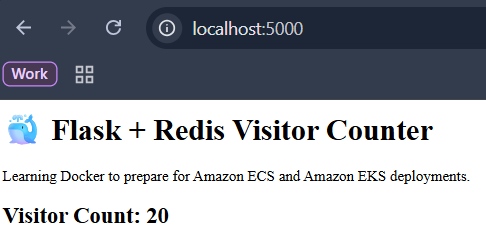
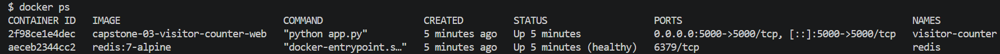

# Capstone 03 – Visitor Counter Application with Docker Compose

## 📌 Overview

This project demonstrates how to build and orchestrate a multi-container application using Docker Compose.

The application consists of a Python Flask web application and a Redis database working together to track and persist visitor counts. This capstone introduces concepts that closely resemble real-world container deployments and prepares the foundation for deploying applications to Amazon ECS and Amazon EKS.

---

## 🎯 Objectives

* Build a multi-container application.
* Containerize a Flask application.
* Integrate Redis with Flask.
* Orchestrate services using Docker Compose.
* Enable service-to-service communication.
* Implement persistent storage using Docker volumes.
* Add health checks for service monitoring.
* Configure applications using environment variables.
* Simulate real-world containerized application architecture.

---

## 🏗️ Project Architecture

```text
                ┌─────────────────┐
                │ Browser          │
                │ localhost:5000  │
                └────────┬────────┘
                         │
                         ▼
               ┌──────────────────┐
               │ Flask Application │
               │ Visitor Counter   │
               └────────┬─────────┘
                        │
                        │ host="redis"
                        ▼
               ┌──────────────────┐
               │ Redis            │
               │ Visitor Storage  │
               └────────┬─────────┘
                        │
                        ▼
               ┌──────────────────┐
               │ Named Volume     │
               │ Persistent Data  │
               └──────────────────┘
```

---

## 📂 Project Structure

```text
capstone-03-visitor-counter/
├── app.py
├── requirements.txt
├── Dockerfile
├── docker-compose.yml
├── .dockerignore
├── README.md
└── screenshots/
```

---

## 🛠️ Technologies Used

* Docker
* Docker Compose
* Python
* Flask
* Redis
* Git
* GitHub

---

## 🐍 Application Features

The application provides:

* Visitor counter functionality.
* Persistent visitor tracking.
* Automatic Redis integration.
* Multi-container deployment.
* Configuration through environment variables.

Example output:

```text
🐳 Flask + Redis Visitor Counter

Visitor Count: 42
```

---

## 🐳 Dockerfile

```dockerfile
# Use official lightweight Python image
FROM python:3.12-slim

# Create a non-root user
RUN useradd -m appuser

# Set working directory
WORKDIR /app

# Copy dependencies first for layer caching
COPY requirements.txt .

# Install dependencies
RUN pip install --no-cache-dir -r requirements.txt

# Copy application code
COPY app.py .

# Change ownership to non-root user
RUN chown -R appuser:appuser /app

# Switch to non-root user
USER appuser

# Document Flask port
EXPOSE 5000

# Start the application
CMD ["python", "app.py"]
```

---

## 🐳 Docker Compose Configuration

```yaml
services:

  web:
    build: .
    container_name: visitor-counter

    ports:
      - "5000:5000"

    depends_on:
      - redis

    environment:
      REDIS_HOST: redis
      REDIS_PORT: 6379

  redis:
    image: redis:7-alpine
    container_name: redis

    volumes:
      - redis-data:/data

    command: redis-server --appendonly yes

    healthcheck:
      test: ["CMD", "redis-cli", "ping"]
      interval: 10s
      timeout: 5s
      retries: 3

volumes:
  redis-data:
```

---

## 🚀 Start the Application Stack

Run:

```bash
docker compose up -d
```

This command will:

* Build the Flask image.
* Pull the Redis image.
* Create the Docker network.
* Start all services.

---

## 🌐 Access the Application

Open:

```text
http://localhost:5000
```

Refresh the page multiple times to see the visitor count increase.

---

## 🛑 Stop the Application Stack

```bash
docker compose down
```

---

## 📸 Screenshots

### Visitor Counter Running

```text
capstone-03-visitor-counter/
└── screenshots/
    └── visitor-counter.png
```

example:



---

### Docker Compose Services

```text
capstone-03-visitor-counter/
└── screenshots/
    └── docker-ps.png
```

example:




---

## 🌐 Docker Networking

Docker Compose automatically created a network and provided service discovery.

Example:

```python
redis.Redis(
    host="redis",
    port=6379
)
```

No IP addresses were required.

Benefits:

* Automatic DNS resolution.
* Simplified service communication.
* Reduced configuration complexity.

---

## 💾 Persistent Storage

Redis data is stored using Docker named volumes.

```yaml
volumes:
  - redis-data:/data
```

Benefits:

* Data survives container recreation.
* Visitor count persists after restarts.
* Simulates production storage patterns.

---

## ❤️ Health Checks

Redis health monitoring was implemented using:

```yaml
healthcheck:
  test: ["CMD", "redis-cli", "ping"]
  interval: 10s
  timeout: 5s
  retries: 3
```

Benefits:

* Detect unhealthy services.
* Improve reliability.
* Align with orchestration best practices.

---

## 🔐 Environment Variables

Application configuration was externalized.

Example:

```yaml
environment:
  REDIS_HOST: redis
  REDIS_PORT: 6379
```

Benefits:

* Environment-specific configuration.
* Improved portability.
* Cloud-native application design.

---

## 📚 Concepts Learned

* Docker Compose
* Multi-Container Applications
* Flask and Redis Integration
* Docker Networking
* Service Discovery
* Docker Volumes
* Persistent Data
* Health Checks
* Environment Variables
* Production-Oriented Container Design

---

## ☁️ AWS Relevance

This capstone closely resembles container workloads deployed on AWS.

The concepts directly map to:

* Amazon ECR (Elastic Container Registry)
* Amazon ECS (Elastic Container Service)
* Amazon EKS (Elastic Kubernetes Service)

```text
Flask Application
        ↓
Redis
        ↓
Docker Compose
        ↓
Amazon ECS / Amazon EKS
```

---

## 🏁 Outcome

By completing this project, I learned how to build and orchestrate multi-container applications using Docker Compose, implement persistent storage, configure service communication, monitor application health, and apply cloud-native design principles.

This capstone strengthened my understanding of how real-world applications are composed before being deployed to AWS container platforms such as ECS and EKS.
